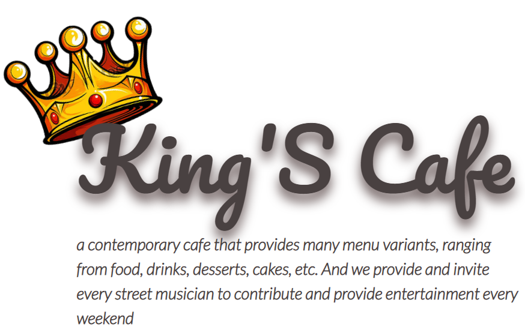

# King's Cafe Website

 

## Table of Contents
- Introduction
- Features
- Requirements
- Usage
- Create Environment Variable
- Screenshots
- Release APK
- Related Project
- Contributors

### Introduction
<b>King's Cafe</b> Website is a simple online commerce website that can be engaged in the food sector where the target is buyers who want to see what products or foods are available and what we sell. You can also order food online

### Features
- Users/Customers who are not logged in can only view landing page
- Users/Customers must sign up and sign in to make a transaction and see their profiles
- Users/Customers can add the products to their wishlist and their cart for later transaction
- And others

### Requirements
npm
Vue.js
Vue.js Cli
Backend King's Cafe

### Usage for development
Open your terminal or command prompt
Type git clone https://github.com/alanard/Kingscafe-frontend-vue
Open the folder and type npm install for install dependencies
Create Environment Variable here
Before run this, you must run backend first
Type react-native run-android for run this app. Make sure your device is connected with debugging mode.
